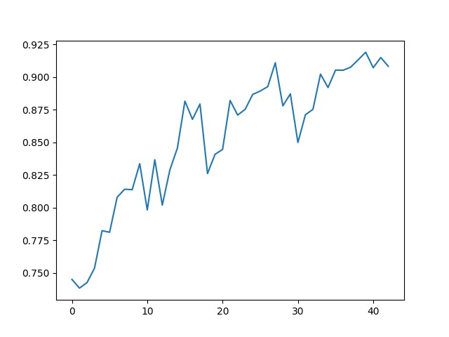
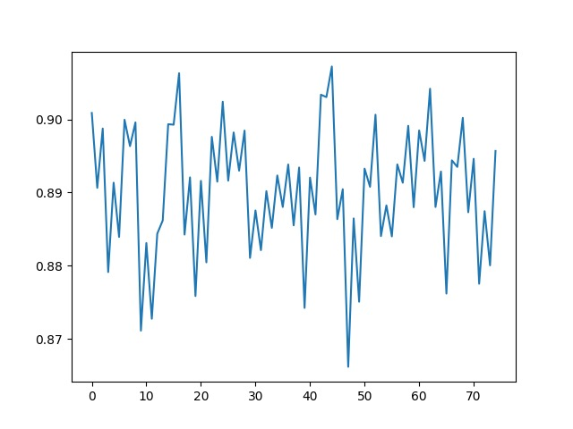
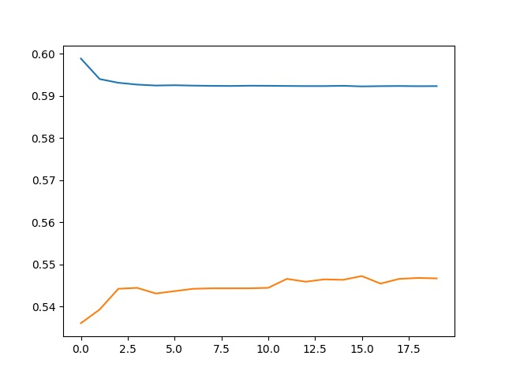
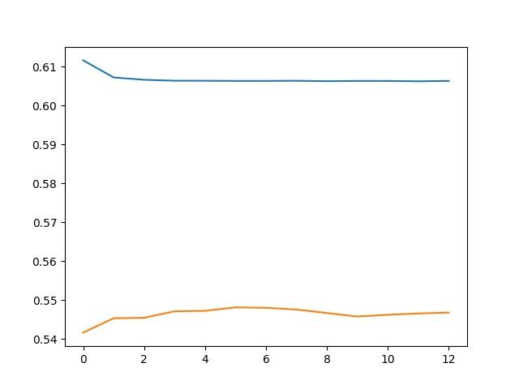
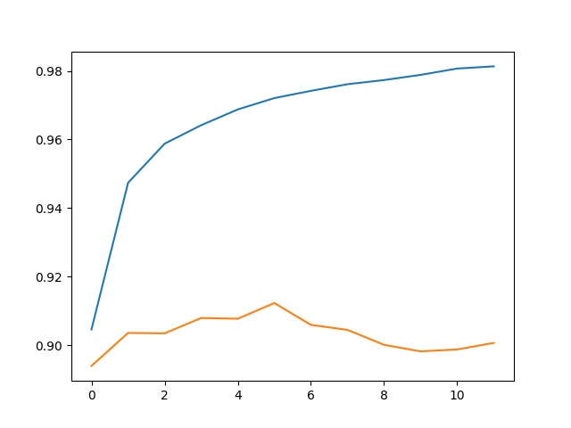

# Sequence Model

## HMM

### Statistic Model

由于整个过程中全部都是概率连成，故而采用log处理，将连成全部改为连加，既加快运算效率，有解决了句子过长导致后期概率值几乎为零的精度问题。

最终统计模型基于train_corpus.utf8，保存在hmm_model.json中，全集正确率为0.8501340074226773。

### EM

跪在nan问题上了，用了助教后来提供的论文scale了也还是GG，看面试前能不能调出来吧，**看造化了**

## CRF

Implemented this model based on the paper *Discriminative training methods for hidden Markov models: Theory and experimentswith perceptron algorithms*. 

### Experiments

采用CRF++常用模板，B类增加B02

~~~
Template:
# Unigram
U01:%x[-1,0]
U02:%x[0,0]
U03:%x[1,0]
U05:%x[-2,0]/%x[-1,0]/%x[0,0]
U06:%x[-1,0]/%x[0,0]/%x[1,0]
U07:%x[0,0]/%x[1,0]/%x[2,0]
U08:%x[-1,0]/%x[0,0]
U09:%x[0,0]/%x[1,0]

# Bigram
B02:%x[0,0]
~~~

#### A

使用train.utf8训练，所有能观察到的80487个特征全部采纳，并初始化所有特征函数参数为0：

观察到准确率从最初30.6%（全部标记为B，该准确率接近最忌猜测值25%）逐步上升，在99.85%之后开始震荡，但仍可上升，在迭代29次后达到100%准确率。

#### B

在A的基础上，初始化特征函数参数为对应的特征函数观察到的出现次数，因此最初准确率已达83%，同样在99.8%之后开始震荡，迭代25次后也达到100%。

#### C

由于特征函数过多导致训练效率低下，尝试删去只出现过一次的特征函数，发现所需迭代次数从原来的20+到现在80+，过程中震荡较多，并且最高准确率仅有99.97%，之后标签几乎没有改变过。

#### D

尝试另一种减少特征函数的方法：在B的基础上，去除B02模板可见字，及B类模板充当HMM中的转移矩阵。

在train.utf8上迭代300次的准确率如下图：

在train_corpus.utf8上共生成602921个特征函数，训练结果如下：

由于训练集过大，迭代周期指数增长，故而迭代次数少很多，震荡表现得更明显，但实际和上图差不多，准确率略小于小语料。

#### E

仍然基于B的基础上，删去出现3次以下的特征函数：

train.utf8：震荡明显于之前的实验

train_corpus.utf8: 共327448特征函数，明显多于D实验，因为字的组合更多

准确率明显高于小预料

#### F

考虑到train_corpus.utf8中共包含23444句子，删除1、2次出现的特征函数对于其训练可能微乎其微，故而此处采取删除1%即20次出现次数一下的特征函数，删减后只剩下36641个

（开始准确率很高的原因是……前面的被历史冲掉了_(:зゝ∠)_忘记采集了，真是尴尬）

#### G

之前所有迭代都是一次输入所有句子，再一起调整一下参数，在后续实验中采取神经网络中mini-batch的想法，每一次解析一句句子后就调整一下参数，虽然这样导致句子遍历顺序不一就会参数不同，存在很大偏差，但是大大提高了大语料库的训练效率。

train.utf8:

train_corpus.utf8为训练集，train.utf8为测试集：

可以清楚地看到过拟合现象，在中间14次迭代时可取的在训练集上的最优模型。

#### H

重新加回B02:%x[0,0]模板，但仍然过滤出现20次以下的模板：

train_corpus.utf8为训练集，train.utf8为测试集，结果：伤亡惨重_(:зゝ∠)_

#### I

在H的基础上，改成删除三次以下特征函数：

#### J

在D的基础上使用mini-batch:目前最优解

