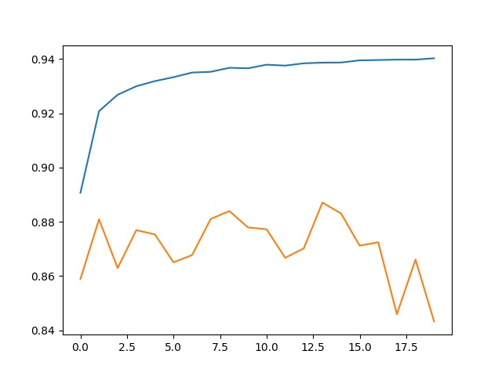

# Sequence Model

## CRF

Implemented this model based on the paper *Discriminative training methods for hidden Markov models: Theory and experimentswith perceptron algorithms*. 

### Experiments

Based on train.utf8, containing 178 sentences

#### A

~~~
Template:
# Unigram
U01:%x[-1,0]
U02:%x[0,0]
U03:%x[1,0]
U05:%x[-2,0]/%x[-1,0]/%x[0,0]
U06:%x[-1,0]/%x[0,0]/%x[1,0]
U07:%x[0,0]/%x[1,0]/%x[2,0]
U08:%x[-1,0]/%x[0,0]
U09:%x[0,0]/%x[1,0]

# Bigram
B02:%x[0,0]
~~~

Number of feature functions: 80487 only contain all observed correct features.

Initialize all parameters as 0. 


~~~
0.30649670133064966
0.6185843676618584
0.7713295314771329
0.8326065078832606
0.884490663088449
0.8852733981885273
0.8993626299899362
0.9433076148943308
0.9546013641954602
0.9688024152968803
0.9819970926981997
0.991389913899139
0.9955272279995527
0.9972045174997205
0.9970926981997092
0.9979872525997987
0.9978754332997876
0.9985463490998546
0.9973163367997316
0.9982108911998211
0.9979872525997987
0.99809907189981
0.9977636139997763
0.9979872525997987
0.99809907189981
0.9974281560997428
0.998769987699877
0.9997763613999776
1.0
~~~

Iterated 29 times to achieve 100% and viberated after achieving 99.85%. In the beginning, all the predicted tags are `B` , thus the accuracy was only 30.6%, which was similar to the accuracy of ramdom selection 1/4 = 25%.


#### B

Initialize parameters as the right counts.


~~~
0.8283573744828358
0.8380856535838086
0.8946662193894667
0.9109918371910992
0.9376048305937604
0.9358157217935815
0.9449849043944984
0.9703678854970368
0.9832271049983227
0.9897126243989712
0.9911662752991166
0.9953035893995303
0.9983227104998322
0.9983227104998322
0.9974281560997428
0.998769987699877
0.9983227104998322
0.9991054455999105
0.9995527227999552
0.9998881806999889
0.9998881806999889
0.9997763613999776
0.9997763613999776
0.9998881806999889
1.0
~~~

Iterated 25 times to achieve 100% and viberated after achieving 99.8%. In the beginning, the accuracy was already as high as 83%.


#### C

Remove features which were only observed once.


~~~
0.7794923403779492
0.7677513138767751
0.8184054567818405
0.8283573744828358
0.8418875097841888
0.8411047746841105
0.8815833612881583
0.8602258749860225
0.8962316895896232
0.8808006261880801
0.8718550821871855
0.8841552051884155
0.9069663423906966
0.9297774795929777
0.9263110812926311
0.9336911550933691
0.9523649781952365
0.9257519847925751
0.9412948674941295
0.9307838532930783
0.9407357709940736
0.902269931790227
0.9074136195907414
0.9098736441909874
0.9312311304931231
0.9085318125908531
0.9310074918931007
0.9503522307950352
0.9699206082969921
0.9837862014983786
0.9831152856983115
0.9728279100972828
0.9705915240970592
0.9790897908979089
0.9789779715978978
0.9538186290953818
0.9619814379961982
0.9737224644973722
0.9529240746952924
0.9679078608967908
0.9750642960975064
0.9708151626970816
0.9722688135972268
0.9575086659957509
0.9632114502963212
0.9677960415967796
0.9758470311975848
0.9795370680979537
0.9853516716985352
0.9816616347981661
0.9838980207983898
0.9881471541988147
0.9882589734988259
0.9769652241976965
0.9750642960975064
0.9812143575981215
0.9880353348988036
0.9929553840992955
0.9941853963994185
0.9967572402996757
0.9970926981997092
0.9976517946997652
0.9985463490998546
0.9976517946997652
0.997539975399754
0.998769987699877
0.9991054455999105
0.9995527227999552
0.9995527227999552
0.9989936262998994
0.9989936262998994
0.9988818069998882
0.9983227104998322
0.9986581683998658
0.9986581683998658
0.9984345297998435
0.9992172648999217
0.9994409034999441
0.9996645420999665
0.9997763613999776
0.9997763613999776
......
~~~

Need more than 80 iterations to converge and cannot achieve 100%.

#### D

Remove B macros' observation -> transition table

Iterated 300 times

~~~
there are 602921 feature functions in this model
0.74515600772352
0.7384854370401625
0.7426991261372656
0.7538615234557927
0.7825049596464059
0.7812599630474414
0.8080434727079906
0.8142126389859901
0.8138758465929571
0.8337702489330966
0.7983077128296142
0.8367834055954839
0.8020512170409383
0.8289832559309992
0.8457140802871439
0.881667614289458
0.8677266797284091
0.8794671111821697
0.8262179633331472
0.8409687133111517
0.8446668073121791
0.8821737489250552
0.870993376731619
0.8753764080712865
0.8868188350199757
0.8893769435333495
0.8927950079042147
0.9110603189499645
0.8780593946629758
0.8872133362219272
0.8500053451601703
0.8712525933487286
0.8753820843475736
0.9023339902046392
0.8920684445394695
0.9054351291494762
0.9052884920120602
0.9076602294540085
0.9133346136489847
0.9190960340803628
0.907271404528344
0.9150497951337283
0.9083281379637872
~~~

there are 178 sentences
finish configuration. start training
there are 6864 feature functions in this model


#### E

Based on B. Remove features which were observed less than 3 times.

Total 327448 feature functions

~~~
crf2_model.json
crf2.py
id: 6825
there are 327448 feature functions in this model
0.7448920608761711
0.7378364494513406
0.7416206336427219
0.7521245829119486
0.7805939466297582
0.7788115958756177
0.8047928584875941
0.8078315583932733
0.8153980346839402
0.8329774623450021
0.8024570707954639
0.8353832574446729
0.7889191518507972
0.8180592622165291
0.8501018418570505
0.8772372806473983
0.8441398596635292
0.8673898873353761
0.8499485823972996
0.8635205589996887
0.8716243894455319
0.894688992092001
0.8795588776488107
0.8673700203683714
0.8863145924764742
0.8854461222045522
0.8924156434390288
0.902200597711893
0.8670152531004294
0.8809779467205787
0.8375951131045353
0.8698969093621663
0.8777566599276653
0.9005506934044508
0.8828549020795038
0.8878178596465004
0.8683775594093267
0.884799026707826
0.8901924352265922
0.889435598388316
0.8999518462561646
0.9046678858046736
0.9121492179510345
0.9163742596007118
0.9206068696187718
0.90559595697761
0.8939028278262416
0.8991316243326828
0.9014901171299612
0.8977948612670773
0.9063934737959436
0.9141510513882752
0.9168463365785866
0.9044011008191812
0.9066999927154454
0.8549342450694445
0.864705954697639
0.8543382360593019
0.8944732935930924
0.8930920663632381
0.9061881818035611
0.8949661835840198
0.9102769928223486
0.9238385629182114
0.9325204274992881
0.9327011222944266
0.9224828789316492
0.8857545332161497
0.910843674405008
0.9085305918180262
0.9237780159711494
0.9116090256577148
0.9162058634041953
0.9046196374562335
0.9193694413881901
0.9153809112504742
0.9252831752332713
0.9260608250846002
0.9384861938770007
0.9313246252948116
0.923884919174556
0.9205463226717098
0.933414441014502
0.9405372217087294
0.9443337044987328
0.9331126523252393
0.9270267380994502
~~~


#### F

Remove features which were observed less than 20 times.

Total 36641 feature functions

```
crf3_model.json
crf3.py
id: 7106

0.9008808634751488
0.8906399150072231
0.8987494217293532
0.8791199122826104
0.89134377326682
0.8839258262056647
0.8999490081180211
0.8963436266296826
0.8995914027119356
0.8711106864415519
0.8830933056835608
0.8727341014596545
0.8843742520323434
0.8861755237074409
0.8993435386474001
0.899277315424051
0.9063158980200202
0.88424842790798
0.8920703366315652
0.8758409166807786
0.8915935294234512
0.8804472148877375
0.8976170046100824
0.8914856801739968
0.9024200803949931
0.89162474894303
0.8982167978044163
0.8929936775742623
0.8984693920991911
0.8810574145885977
0.8875472904768167
0.8821188782542801
0.8901905431344965
0.8851670386204378
0.8923276611565791
0.8880278818691221
0.8938309283266054
0.8855095072897579
0.8934156141116013
0.874217501662676
0.8920400631580342
0.8869995298151142
0.9033793710875083
0.9030492010168103
0.9072354547785259
0.8863533803644359
0.8904525978897497
0.8661647577034165
0.886456499383651
0.8750623207834018
0.8932651927899938
0.8907799298223041
0.9006424598710918
0.8840421898695497
0.8882388501377916
0.8839996177973967
0.8938432269252273
0.8913380969905329
0.8991259480563957
0.8879900400272083
0.8984854748820044
0.8943266564556763
0.9041939167347032
0.8880222055928351
0.8928706915880423
0.8761748709356679
0.8944013940934561
0.8934998122098595
0.9002120089193222
0.8873032105964725
0.8946123623621256
0.8775220405077997
0.8874498477338886
0.8800404150871639
0.8956880167185257
```


#### G

Modify parameters after each sentence. Based on F





~~~
there are 36641 feature functions in this model
0.8906559977900365 0.8588840433858884
0.9207818881376232 0.8809124454880912
0.9268072554163501 0.8629095381862909
0.9299329915584311 0.8768869506876887
0.9318326520225045 0.8753214804875321
0.9332886168901385 0.8650341048865035
0.9349877155920687 0.8677177680867718
0.9352630149919917 0.8810242647881025
0.9367397928726783 0.8839315665883931
0.9365543678473006 0.8778933243877893
0.9378864006826668 0.8772224085877223
0.937542985967299 0.8667113943866711
0.9383915892722162 0.8701777926870178
0.9386413454288474 0.8870625069887063
0.9386914858693832 0.8830370121883037
0.9394861645495732 0.8711841663871184
0.939610096581841 0.8724141786872415
0.9397472732587786 0.8459130045845913
0.9397595718574006 0.866040478586604
0.9402486776641367 0.8432293413843229
~~~

24310 最后model crf_perS.json是当前最好模型

参数：template2.utf，B类只有转移矩阵，过滤掉20次以下，每句话后都调参

~~~
there are 36641 feature functions in this model
0.8906559977900365 0.8588840433858884
0.9207818881376232 0.8809124454880912
0.9268072554163501 0.8629095381862909
0.9299329915584311 0.8768869506876887
0.9318326520225045 0.8753214804875321
0.9332886168901385 0.8650341048865035
0.9349877155920687 0.8677177680867718
0.9352630149919917 0.8810242647881025
0.9367397928726783 0.8839315665883931
0.9365543678473006 0.8778933243877893
0.9378864006826668 0.8772224085877223
0.937542985967299 0.8667113943866711
0.9383915892722162 0.8701777926870178
0.9386413454288474 0.8870625069887063
~~~


#### H

加上B02:%x[0,0]模板，仍然过滤出现20次以下的模板


~~~
there are 41878 feature functions in this model
12mins/epoch
0.5988376878256172 0.5360617242536062
0.5939844716001706 0.5393044839539305
0.5931027566835788 0.5442245331544224
0.5926685215476178 0.5444481717544448
0.592447146772422 0.5431063401543106
0.5925181002260104 0.5436654366543665
0.5924263337593694 0.5442245331544224
0.592374301226738 0.5443363524544337
0.5923411896150633 0.5443363524544337
0.5924026826081733 0.5443363524544337
0.5923847077332642 0.5444481717544448
0.5923449737992547 0.5465727384546573
0.5923156463717715 0.5459018226545902
0.5923184845099151 0.5464609191546461
0.5923828156411686 0.5463490998546349
0.5922409087339917 0.5472436542547243
0.5923024017271017 0.5454545454545454
0.5923345672927284 0.5465727384546573
0.5922910491745276 0.5467963770546796
0.5923090240494365 0.5466845577546685
~~~


#### I

过滤出现3次以下模板


~~~
there are 234125 feature functions in this model
0.6116679643264956 0.5416526892541653
0.6072584436974885 0.5453427261545343
0.6066624346873459 0.5454545454545454
0.6064164627149062 0.5471318349547132
0.6064022720241885 0.5472436542547243
0.6063634841362269 0.5481382086548138
0.6063644301822747 0.5480263893548026
0.6064060562083798 0.547579112154758
0.6062991530049734 0.5466845577546685
0.6063653762283225 0.545790003354579
0.6063615920441312 0.5462372805546237
0.6062698255774902 0.5465727384546573
0.606368214366466 0.5467963770546796
~~~


#### J

Similar to D, just modify params after each sentence

session id: 24640

result2.json

../data/crf_perS2.json

~~~
there are 602921 feature functions in this model
0.9046527490679082 0.8939953035893995
0.9473695662662684 0.9036117633903612
0.958786449971666 0.90349994409035
0.9641770203522886 0.9079727160907972
0.9687643976382907 0.9077490774907749
0.9720746127597014 0.9123336687912333
0.9741861875384923 0.905959968690596
0.9761161214760967 0.9045063177904507
~~~

